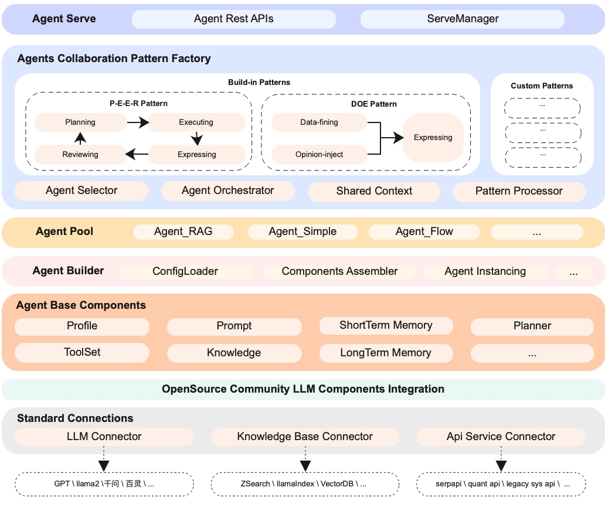

# agentUniverse Introduction
## Introduction
agentuniverse is a framework for developing applications powered by multi-agent based on large language models. It provides all the essential components for building a single agent, and a multi-agent collaboration mechanism which serves as a pattern factory that allowing developers to build and customize multi-agent collaboration patterns. With this framework, developers can easily construct multi-agent applications, and share the pattern practices from different technical and business fields.

The framework will come with several pre-install multi-agent collaboration patterns which have been proven effective in real business scenarios, and will continue to be expanded and enriched in the future. Patterns that are currently soon to be released include:

- PEER pattern：
This pattern utilizes four distinct agent roles: Plan, Execute, Express, and Review, to achieve a multi-step breakdown and sequential execution of a complex task. It also performs autonomous iteration based on evaluative feedback thereby enhancing performance in reasoning and analytical tasks.

- DOE pattern：
This pattern consists of three agents: the Data-finding agent, which is designed to solve data-intensive and high-computational-precision task; the Opinion-inject agent, which combines the data results from the first agent with expert opinions that are pre-collected and structured; and the third agent, the Express agent，which generates the final result based on the given document type and language style.

More patterns are coming soon...

In addition to rich collaboration modes, agentUniverse also includes the following main features:

* **Fast and Simple Development Experience**: Through configuration and simple interfaces, you can quickly complete single-agent construction, multi-agent collaboration process definition, and service-based applications using this framework.
* **Rich Components and Custom Extensions**: The framework provides a wide variety of common domain components (LLM, knowledge, tools, memory, collaboration patterns, etc.) and technical components (DB, RPC, Message, etc.) with default implementations. It offers extension standards for all types of components, allowing you to customize any part to enhance your agent capabilities.
* **Prompt-Friendly and Management**: The framework has built-in a complete set of prompt management mechanisms. You can manage prompts in multiple versions, switch between them, and specialize them based on expert domain knowledge.

## Acknowledgments
This project is partially based on open-source projects like Langchain, Pydantic, Gunicorn, Flask, SQLAlchemy, Chromadb, and others (a detailed dependency list can be found in requirements.txt). Special thanks are given to the creators and contributors of these related projects and associated parties.